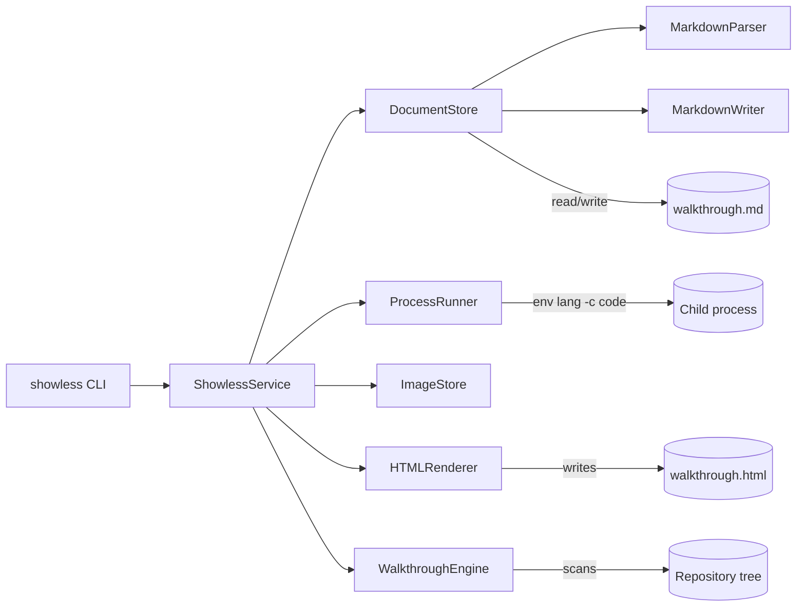
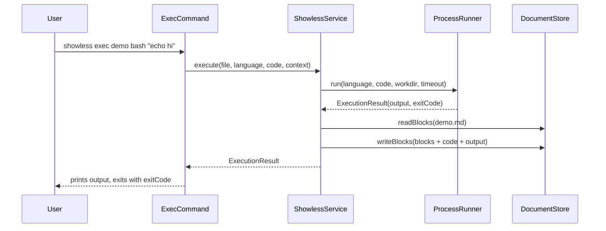

# Showless: A Code Walkthrough

*2026-05-02T03:04:02Z by Showless dev*
<!-- showless-id: 4543f5a0-ec02-4509-9742-2d4c2d9194a2 -->

## 1. What Showless is and why it exists

Showless is a tiny Swift 6.2 command-line tool — fifteen `ShowlessCore` files, roughly 4,000 lines (including the inline CSS and JavaScript that ship with the HTML renderer) — that solves a problem every demo, tutorial, and AI agent transcript eventually hits: the moment someone re-runs the steps, the recorded outputs are stale and nobody notices. Showless treats a single markdown file as the durable record of an author's work. Its small vocabulary — `init`, `note`, `exec`, `image`, `diagram`, `pop`, `verify`, `extract`, `walkthrough`, `codewalk-html` — appends to that document, captures real stdout, and stamps every source excerpt with a content hash. Months later, `showless verify` re-executes every code block and re-reads every excerpt, failing loudly with a unified diff if anything drifted. Two decisions shape the rest of the codebase: the tool is *intentionally not an AI*, and `ShowlessCore` ships with *zero third-party dependencies* — pure Foundation, with `swift-argument-parser` confined to the CLI shell.

### A static tool, not an AI

The defining design decision is announced loudly in the README: Showless is **intentionally a static tool, not an AI**. There is no language model anywhere. Its job is to be the durable transcript next to an author's judgement:

- A human or an agent decides the narrative.
- Showless records the prose, the commands, the captured stdout/stderr, the source excerpts, and the content hashes.
- Later, `showless verify` re-runs every executable block and re-reads every source excerpt to detect drift.

That contract is the lens through which every file in the repository makes sense. Whenever a design choice in the codebase looks weirdly conservative — no plugins, no async, no third-party dependencies inside `ShowlessCore` — it is in service of being a reliable transcript instead of a clever assistant.

### Headline features

The features are small and composable on purpose:

- A single document model — title, commentary, code, output, image, source excerpt — that round-trips through plain GitHub-flavoured markdown.
- A `verify` step that re-executes every recorded code block and diffs the output, so a stale walkthrough fails loudly.
- Source-excerpt blocks with FNV-1a content hashes for drift detection on real repository files.
- A `codewalk-html` renderer that emits a beautiful, self-contained HTML page — sticky table of contents, dark/light themes, syntax highlighting, mermaid diagrams, copy buttons — from the same markdown file.
- A static `walkthrough` scaffolder for cold-start projects that an author can then rewrite by hand.

Each of these maps onto one or two files in `Sources/ShowlessCore/`, which is what makes the project easy to read top-to-bottom in a single sitting.

### How the pieces fit together

Here is the system at a glance.



Every CLI subcommand goes through `ShowlessService`. The service is the single seam where reads and writes happen: `DocumentStore` handles the markdown round-trip, `ProcessRunner` shells out for `exec`, `ImageStore` copies image files into the document directory, `HTMLRenderer` emits a self-contained HTML view of the same document, and `WalkthroughEngine` produces the static scaffold for a cold-start repository. Notice that `MarkdownParser` and `MarkdownWriter` only ever talk to disk through `DocumentStore` — the rest of the codebase never touches files directly.

## 2. Repository shape

The repo is a single Swift Package with two products: a `showless` executable and a `ShowlessCore` library. The split lets the tests talk to the same types the CLI uses, without going through a process boundary.

### File census

These are every Swift file the package ships, in the order they sort on disk.

```bash
find Sources Tests -type f -name '*.swift' | sort
```

```output
Sources/ShowlessCLI/main.swift
Sources/ShowlessCore/Blocks.swift
Sources/ShowlessCore/Configuration.swift
Sources/ShowlessCore/Diffing.swift
Sources/ShowlessCore/DocumentStore.swift
Sources/ShowlessCore/Errors.swift
Sources/ShowlessCore/Hashing.swift
Sources/ShowlessCore/ImageStore.swift
Sources/ShowlessCore/MarkdownParser.swift
Sources/ShowlessCore/MarkdownWriter.swift
Sources/ShowlessCore/ProcessRunner.swift
Sources/ShowlessCore/ShellQuoting.swift
Sources/ShowlessCore/ShowlessService.swift
Sources/ShowlessCore/WalkthroughEngine.swift
Sources/ShowlessCore/renders/HTMLRenderer.swift
Tests/ShowlessCLITests/CLIPackageTests.swift
Tests/ShowlessCoreTests/EnhancementTests.swift
Tests/ShowlessCoreTests/MarkdownTests.swift
Tests/ShowlessCoreTests/ServiceTests.swift
```

Fourteen `ShowlessCore` files live next to the CLI's single `main.swift`, with `HTMLRenderer.swift` tucked under `renders/` because of how big it is on its own. A useful grouping is *domain* (`Blocks`, `Errors`), *markdown I/O* (`MarkdownParser`, `MarkdownWriter`, `DocumentStore`), *side effects* (`ProcessRunner`, `ImageStore`), *verification* (`Hashing`, `Diffing`), *coordination* (`ShowlessService`), *static scaffold* (`WalkthroughEngine`), *HTML rendering* (`renders/HTMLRenderer`), and *glue* (`Configuration`, `ShellQuoting`). We will walk them in roughly that order.

### Lines per file

The line counts give a quick sense of where the weight sits.

```bash
wc -l Sources/ShowlessCore/*.swift Sources/ShowlessCore/renders/*.swift Sources/ShowlessCLI/*.swift | sort -n
```

```output
      12 Sources/ShowlessCore/Hashing.swift
      16 Sources/ShowlessCore/ShellQuoting.swift
      27 Sources/ShowlessCore/Errors.swift
      42 Sources/ShowlessCore/DocumentStore.swift
      61 Sources/ShowlessCore/ImageStore.swift
      68 Sources/ShowlessCore/MarkdownWriter.swift
      75 Sources/ShowlessCore/ProcessRunner.swift
      81 Sources/ShowlessCore/Configuration.swift
      84 Sources/ShowlessCore/Diffing.swift
     111 Sources/ShowlessCore/Blocks.swift
     210 Sources/ShowlessCore/MarkdownParser.swift
     261 Sources/ShowlessCore/ShowlessService.swift
     333 Sources/ShowlessCore/WalkthroughEngine.swift
     444 Sources/ShowlessCLI/main.swift
    1984 Sources/ShowlessCore/renders/HTMLRenderer.swift
    3809 total
```

About 3,800 lines of Swift in total, but `HTMLRenderer.swift` alone accounts for roughly half of that — and most of *its* weight is the inline CSS and JavaScript stylesheet that ship with every rendered page. Strip those out and the actual Swift logic is closer to 2,000 lines. The interesting model still lives in the smaller files: `Blocks.swift` defines the document, `ShowlessService.swift` orchestrates every command, and `Hashing.swift` is twelve lines that anchor the entire `verify` story.

### Package wiring

The `Package.swift` makes the dependency story explicit and unsurprising.

```bash
sed -n '14,31p' Package.swift
```

```output
    dependencies: [
        .package(url: "https://github.com/apple/swift-argument-parser", from: "1.3.0")
    ],
    targets: [
        .executableTarget(
            name: "ShowlessCLI",
            dependencies: [
                "ShowlessCore",
                .product(name: "ArgumentParser", package: "swift-argument-parser")
            ]
        ),
        .target(
            name: "ShowlessCore"
        ),
        .testTarget(
            name: "ShowlessCoreTests",
            dependencies: ["ShowlessCore"]
        ),
```

The trick is that `ShowlessCore` has zero external dependencies — it is pure Foundation. Only `ShowlessCLI` pulls in `swift-argument-parser`, and only because parsing flags is annoying enough to delegate. Both test targets depend on `ShowlessCore` directly, which means every behavioural test runs in-process against the same types the CLI uses, with no subprocess boundary to fake. That choice is what makes `swift test` finish in seconds and keeps refactors honest.

### Build and test sanity

A fresh build and a green test run prove the package still hangs together.

```bash
swift build >/dev/null 2>&1 && echo 'swift build ok'
```

```output
swift build ok
```

```bash
swift test >/dev/null 2>&1 && echo 'swift test passed'
```

```output
swift test passed
```

That is the entire build contract. No code generation, no SwiftPM plugins, no platform-specific shims. The binary that comes out of `swift build` lives at `.build/debug/showless`, weighs about three megabytes, and is the same binary used to author and verify this very walkthrough.

## 3. The data model — Blocks.swift

Everything in Showless is a list of `ShowBlock`s. Read this file first; the rest of the codebase is just code that produces or consumes these six cases.

### Six block types, one enum

`ShowBlock` is a closed enum, which lets the parser, the writer, the verifier, and the extractor exhaustively switch on it.

```bash
sed -n '3,10p' Sources/ShowlessCore/Blocks.swift
```

```output
public enum ShowBlock: Equatable, Sendable {
    case title(TitleBlock)
    case commentary(CommentaryBlock)
    case code(CodeBlock)
    case output(OutputBlock)
    case imageOutput(ImageOutputBlock)
    case sourceExcerpt(SourceExcerptBlock)
}
```

The whole document model fits in seven lines. `title` is the document header, `commentary` is prose, `code` is anything inside fenced backticks (an executable snippet, an image marker, or a diagram), `output` is captured stdout/stderr, `imageOutput` is a markdown `` line, and `sourceExcerpt` is a hashed slice of a real repository file. `Sendable` makes the type safe to hand across actors in Swift 6, and `Equatable` is what powers the round-trip tests in `MarkdownTests.swift`.

### TitleBlock carries verifier identity

A document is identified by two things: the title and a stable UUID written into a hidden HTML comment.

```bash
sed -n '12,28p' Sources/ShowlessCore/Blocks.swift
```

```output
public struct TitleBlock: Equatable, Sendable {
    /// Name stamped into the dateline. The parser/writer hard-code this
    /// literal, so it is not a per-instance field.
    public static let generator: String = "Showless"

    public var title: String
    public var timestamp: String
    public var version: String
    public var documentID: String

    public init(title: String, timestamp: String, version: String = "", documentID: String = "") {
        self.title = title
        self.timestamp = timestamp
        self.version = version
        self.documentID = documentID
    }
}
```

The `documentID` is what links a markdown document to its rendered HTML output and to any external system that wants to track it. Notice that `generator` is a *static* property holding the literal `"Showless"` — the parser and writer hard-code it on both ends, so it is not per-instance state and cannot drift between read and write. The `timestamp` and `version` are stamped once at `init` time and are never re-derived, so verifying a document does not silently rewrite its dateline.

### CodeBlock distinguishes three flavours

A `code` block can mean three different things depending on its language and a flag.

```bash
sed -n '38,52p' Sources/ShowlessCore/Blocks.swift
```

```output
public struct CodeBlock: Equatable, Sendable {
    public var language: String
    public var code: String
    public var isImage: Bool

    public init(language: String, code: String, isImage: Bool = false) {
        self.language = language
        self.code = code
        self.isImage = isImage
    }

    public var isDiagram: Bool {
        DiagramLanguage.isDiagram(language)
    }
}
```

A `CodeBlock` is *executable* if `isImage` is false and `isDiagram` is false. The verifier uses exactly that predicate to decide what to re-run. Image blocks are stored with a `bash` language and a `{image}` info-string suffix so the markdown remains valid even when an image processor isn't around. The `isDiagram` computed property delegates to `DiagramLanguage`, which is worth a closer look.

### DiagramLanguage is a small allow-list

Diagrams are first-class on disk but always skipped by `verify`, and a tiny enum decides which fenced languages count.

```bash
sed -n '54,75p' Sources/ShowlessCore/Blocks.swift
```

```output
public enum DiagramLanguage {
    public static let known: Set<String> = [
        "mermaid",
        "plantuml",
        "puml",
        "dot",
        "graphviz",
        "d2"
    ]

    public static func isDiagram(_ language: String) -> Bool {
        known.contains(language.lowercased())
    }

    public static func canonicalize(_ language: String) -> String {
        let lower = language.lowercased()
        if known.contains(lower) {
            return lower
        }
        return language
    }
}
```

The `known` set is the entire list of formats GitHub will render natively, plus `puml` as an alias for `plantuml`. `canonicalize` is what lets the user type `Mermaid` or `MERMAID` and have it written to disk as `mermaid` so the parser does not have to be case-sensitive. Adding a new diagram language is one entry in this set plus zero changes elsewhere — the verifier already skips them by virtue of `isDiagram`.

### SourceExcerptBlock anchors text in real files

The richest block carries enough metadata to be re-validated against a file on disk.

```bash
sed -n '95,111p' Sources/ShowlessCore/Blocks.swift
```

```output
public struct SourceExcerptBlock: Equatable, Sendable {
    public var path: String
    public var language: String
    public var startLine: Int
    public var endLine: Int
    public var hash: String
    public var content: String

    public init(path: String, language: String, startLine: Int, endLine: Int, hash: String, content: String) {
        self.path = path
        self.language = language
        self.startLine = startLine
        self.endLine = endLine
        self.hash = hash
        self.content = content
    }
}
```

Notice every field a verifier needs is here: the relative `path`, the line range, the FNV-1a `hash`, and the `content` itself. When `verify` walks the document it re-reads the file, slices the same line range, recomputes the hash, and either confirms the excerpt or replaces it. A new engineer who wants to add a seventh block type should start with this struct and follow its shape: equatable, sendable, immutable-feeling, and rich enough to stand on its own.

### Errors are a closed enum too

Failures share the same closed-enum discipline as the data model.

```bash
sed -n '3,10p' Sources/ShowlessCore/Errors.swift
```

```output
public enum ShowlessError: Error, CustomStringConvertible, Equatable {
    case fileNotFound(String)
    case fileAlreadyExists(String)
    case emptyDocument
    case titleOnlyDocument
    case invalidImage(String)
    case execution(String)

```

The cases name every place the system can refuse to act: the file is missing, the file is already there, the document is empty or has only a title, an image is wrong, or a subprocess failed. `CustomStringConvertible` means each case can become a single user-facing line without ceremony. The CLI does not catch these by case — it lets `ArgumentParser`'s generic exit machinery turn them into messages — and that simplicity is only safe because the cases are this narrow.

## 4. The CLI entry point — main.swift

`Sources/ShowlessCLI/main.swift` is the only file in the executable target. It declares the root command, wires up ten subcommands, and provides four helpers — `makeService`, `resolvedContext`, `readStdin`, `resolvedFile` — that every subcommand calls. After that, each subcommand is roughly fifteen lines of glue.

### One root command, ten subcommands

The root command uses Swift Argument Parser's `subcommands` list to attach every verb at the same level.

```bash
sed -n '42,55p' Sources/ShowlessCLI/main.swift
```

```output
        version: appVersion,
        subcommands: [
            InitCommand.self,
            NoteCommand.self,
            ExecCommand.self,
            ImageCommand.self,
            DiagramCommand.self,
            PopCommand.self,
            VerifyCommand.self,
            ExtractCommand.self,
            WalkthroughCommand.self,
            HTMLCommand.self,
        ]
    )
```

That list is the source of truth for the public surface area. Adding a new verb means writing a new `ParsableCommand` struct and appending it here. There is no plugin mechanism, no dynamic dispatch, no registry — the entire command vocabulary is a static array, which is exactly the right amount of cleverness for a tool whose job is to be predictable. `HTMLCommand` is the newest entry; we will visit it in chapter 10.

### Shared global options

Each subcommand that touches the filesystem or the runner accepts a small group of flags via `OptionGroup`.

```bash
sed -n '9,21p' Sources/ShowlessCLI/main.swift
```

```output
struct GlobalOptions: ParsableArguments {
    @Option(help: "Set working directory for code execution (default: current)")
    var workdir: String?

    @Option(name: .customLong("source-root"), help: "Set repository root for source excerpt verification")
    var sourceRoot: String?

    @Option(help: "Limit command execution time in seconds")
    var timeout: Double?

    @Flag(help: "Emit machine-readable JSON where supported")
    var json: Bool = false
}
```

The four flags here are the entire knob panel: where to run code (`--workdir`), where to look up source excerpts during verification (`--source-root`), how long a single subprocess gets before it is killed (`--timeout`), and whether to emit JSON instead of text (`--json`). Every subcommand that runs code or reads files mounts this group; commands like `init` and `note` skip it because they have nothing to configure. That keeps the help screen for each verb tight.

### File arguments tolerate a missing extension

A small helper auto-appends `.md` so the user never has to type it.

```bash
sed -n '107,109p' Sources/ShowlessCLI/main.swift
```

```output
private func resolvedFile(_ path: String) -> String {
    path.hasSuffix(".md") ? path : path + ".md"
}
```

Every subcommand that takes a document path runs the user's argument through this helper before handing it to the service. The effect is small but kind: `showless note demo "Hi"` and `showless note demo.md "Hi"` mean the same thing, the extension is implicit, and a typo like `demo.markdown` still reaches the service intact for it to reject. The README mentions this convention exactly once at the top of the commands section and never again, because the rule is so simple.

### ExecCommand propagates the child exit code

The `exec` verb is the only subcommand whose own exit code reflects the user's code, not its own success.

```bash
sed -n '168,181p' Sources/ShowlessCLI/main.swift
```

```output
    func run() throws {
        let result = try makeService().execute(
            file: resolvedFile(file),
            language: language,
            code: code ?? readStdin(),
            context: resolvedContext(globals: globals)
        )
        printRaw(result.output)
        if result.exitCode != 0 {
            // Propagate the subprocess exit code without printing an extra error line.
            Foundation.exit(result.exitCode)
        }
    }
}
```

Notice the deliberate `Foundation.exit(result.exitCode)` rather than `throw ExitCode(result.exitCode)`. The CLI prints the captured output verbatim, then exits with the same status the child returned, so that `showless exec demo bash 'false'` behaves like `false` from the shell's point of view. That tiny detail is why Showless composes nicely with `set -e` scripts and CI runners.

### DiagramCommand parses an optional language

`diagram` is the only verb that has to peek at its argument list to decide whether the first token is a language keyword or part of the diagram source.

```bash
sed -n '235,245p' Sources/ShowlessCLI/main.swift
```

```output
    private func resolvedDiagramArgs() -> (language: String, source: String) {
        guard let first = rest.first else {
            return ("mermaid", readStdin())
        }
        if DiagramLanguage.known.contains(first.lowercased()) {
            let src = rest.dropFirst().joined(separator: " ")
            return (DiagramLanguage.canonicalize(first), src.isEmpty ? readStdin() : src)
        }
        return ("mermaid", rest.joined(separator: " "))
    }
}
```

The rule is: if the first remaining word matches a known diagram language (`mermaid`, `plantuml`, `puml`, `dot`, `graphviz`, `d2`), it is the language; otherwise the whole list is the source and the language defaults to `mermaid`. Stdin fills in any missing source. That tolerance is what lets the README and this very walkthrough use the same `showless diagram <<'MMD'` pattern they use for `note` — there is no second flag to remember.

## 5. The coordination layer — ShowlessService.swift

`ShowlessService` is the single seam between the CLI and the rest of the system. Every subcommand instantiates one, calls one method on it, and returns. That funnel is why each verb's behaviour lives in *one* place and can be unit-tested without touching `ArgumentParser`.

### A struct full of injected collaborators

The service is a value type with five dependencies, each defaulted to a real implementation.

```bash
sed -n '17,36p' Sources/ShowlessCore/ShowlessService.swift
```

```output
public struct ShowlessService {
    private let store: DocumentStore
    private let runner: ProcessRunner
    private let imageStore: ImageStore
    private let walkthroughEngine: WalkthroughEngine
    private let version: String

    public init(
        store: DocumentStore = DocumentStore(),
        runner: ProcessRunner = ProcessRunner(),
        imageStore: ImageStore = ImageStore(),
        walkthroughEngine: WalkthroughEngine = WalkthroughEngine(),
        version: String = "dev"
    ) {
        self.store = store
        self.runner = runner
        self.imageStore = imageStore
        self.walkthroughEngine = walkthroughEngine
        self.version = version
    }
```

The defaults make it trivial to construct a real service from `main.swift`, while the explicit parameters mean the test suite can hand in fakes and watch the resulting block lists. Every collaborator is itself a value type, which means there is no global mutable state inside the service — composing two `ShowlessService` instances in the same process is just a matter of passing different collaborators. `HTMLRenderer` is conspicuously absent from this list because it is a stateless `enum` with static methods; the service calls it directly.

### exec is the canonical mutation

The `execute` method is the longest one, and it spells out the standard pattern every other mutation follows.

```bash
sed -n '57,69p' Sources/ShowlessCore/ShowlessService.swift
```

```output
    public func execute(file: String, language: String, code: String, context: CommandContext = CommandContext()) throws -> ExecutionResult {
        guard store.exists(file) else {
            throw ShowlessError.fileNotFound(file)
        }
        let result = try runner.run(language: language, code: code, workdir: context.workdir, timeout: context.timeout)
        var blocks = try store.readBlocks(from: file)
        let codeBlock = ShowBlock.code(CodeBlock(language: language, code: code))
        let outputBlock = ShowBlock.output(OutputBlock(content: result.output))
        blocks.append(codeBlock)
        blocks.append(outputBlock)
        try store.writeBlocks(blocks, to: file)
        return result
    }
```

Read the order: check the file exists, run the child process, parse the existing document, append the new code block and the new output block, write the document back atomically. The result of the child process is *also* returned so the CLI can echo it to stdout and propagate the exit code. Notice that `result.output` is captured even when the child fails — that is what makes `exec` honest about errors. Everything else on the service follows this same shape.

### exec, end to end

A sequence diagram makes the order easier to keep in your head than reading every callee.



The whole runtime path is six messages and one return value. Failures from `Runner` propagate as thrown errors without ever touching the document; failures from `Store` (bad disk, permissions) propagate the same way. The CLI's job after `Service` returns is purely cosmetic: echo the captured output, then mirror the child's exit code. That separation is why the same sequence is exercised end to end by `ServiceTests.initNoteExecVerifyAndExtract` without spawning a subprocess.

### pop knows about output pairs

Removing the most recent entry has to be smarter than a single `removeLast()` because some entries come in pairs.

```bash
sed -n '98,119p' Sources/ShowlessCore/ShowlessService.swift
```

```output
    public func pop(file: String) throws {
        var blocks = try store.readBlocks(from: file)
        guard !blocks.isEmpty else {
            throw ShowlessError.emptyDocument
        }
        if blocks.count == 1, case .title = blocks[0] {
            throw ShowlessError.titleOnlyDocument
        }

        switch blocks.last {
        case .output, .imageOutput:
            if blocks.count >= 2 {
                blocks.removeLast(2)
            } else {
                blocks.removeLast()
            }
        default:
            blocks.removeLast()
        }

        try store.writeBlocks(blocks, to: file)
    }
```

If the last block is an `output` or `imageOutput`, `pop` removes two entries — the output *and* the code/image block that produced it. Otherwise it removes one. The two guard clauses up top reject the meaningless cases (empty document, title-only document) with named errors instead of crashing. The behaviour is exercised by `popRemovesCodeAndOutputPair` and `diagramPopRemovesSingleBlock` in `ServiceTests.swift`.

### verify both replays and re-anchors

The `verify` method is where executable blocks and source excerpts get re-checked in the same loop.

```bash
sed -n '125,144p' Sources/ShowlessCore/ShowlessService.swift
```

```output
        for index in blocks.indices {
            switch blocks[index] {
            case .code(let code) where !code.isImage && !code.isDiagram:
                let result = try runner.run(language: code.language, code: code.code, workdir: context.workdir, timeout: context.timeout)
                let next = blocks.index(after: index)
                if next < blocks.endIndex, case .output(let output) = blocks[next], output.content != result.output {
                    issues.append(VerificationIssue(
                        kind: .commandOutput,
                        blockIndex: index,
                        expected: output.content,
                        actual: result.output
                    ))
                    blocks[next] = .output(OutputBlock(content: result.output))
                }

            case .sourceExcerpt(let source):
                let actual = try readSourceExcerpt(source, sourceRoot: context.sourceRoot ?? context.workdir)
                if actual.content != source.content || actual.hash != source.hash {
                    issues.append(VerificationIssue(
                        kind: .sourceExcerpt,
```

The loop walks every block in order. Code blocks that are neither images nor diagrams get re-run; if the captured `output` block immediately after them disagrees with the new output, an issue is recorded *and* the in-memory block is updated. Source excerpts get re-read and re-hashed; if either the content or the hash changed, an issue is recorded and the block is replaced. Image and diagram blocks fall through the `default` arm and are skipped, which is exactly why diagrams cannot break a build.

### extract round-trips a document into shell

The most surprising method on the service is `extract`, which reverses an entire document back into a list of CLI commands.

```bash
sed -n '170,190p' Sources/ShowlessCore/ShowlessService.swift
```

```output
        return blocks.compactMap { block in
            switch block {
            case .title(let title):
                return "\(commandName) init \(quotedTarget) \(ShellQuoting.quote(title.title))"
            case .commentary(let commentary):
                return "\(commandName) note \(quotedTarget) \(ShellQuoting.quote(commentary.text))"
            case .code(let code):
                if code.isImage {
                    return "\(commandName) image \(quotedTarget) \(ShellQuoting.quote(code.code))"
                }
                if code.isDiagram {
                    return "\(commandName) diagram \(quotedTarget) \(code.language) \(ShellQuoting.quote(code.code))"
                }
                return "\(commandName) exec \(quotedTarget) \(code.language) \(ShellQuoting.quote(code.code))"
            case .output, .imageOutput:
                return nil
            case .sourceExcerpt:
                return nil
            }
        }
    }
```

The trick is the `compactMap`: outputs and source excerpts return `nil` because they are *derived*, not authored. Replaying the emitted commands against an empty file regenerates a byte-equivalent document, which means Showless walkthroughs can be checked into git as either the markdown or the script, whichever the team prefers. `ShellQuoting.quote` is what makes the resulting line safe to paste into a shell.

## 6. The markdown round-trip — MarkdownWriter.swift and MarkdownParser.swift

The writer turns blocks into markdown; the parser turns markdown back into blocks. Together they form a tight contract: parse(write(blocks)) == blocks. The `MarkdownTests` suite enforces that contract on every commit.

### The writer is a switch over the enum

`MarkdownWriter.write` maps each block type to a fragment of markdown.

```bash
sed -n '24,52p' Sources/ShowlessCore/MarkdownWriter.swift
```

```output
    private static func writeBlock(_ block: ShowBlock) throws -> String {
        switch block {
        case .title(let title):
            var dateline = title.timestamp
            if !title.version.isEmpty {
                dateline += " by Showless \(title.version)"
            }
            var result = "# \(title.title)\n\n*\(dateline)*\n"
            if !title.documentID.isEmpty {
                result += "<!-- showless-id: \(title.documentID) -->\n"
            }
            return result

        case .commentary(let commentary):
            return "\(commentary.text)\n"

        case .code(let code):
            var language = code.language
            if code.isImage {
                language += " {image}"
            }
            return "```\(language)\n\(code.code)\n```\n"

        case .output(let output):
            let fence = fence(for: output.content)
            return "\(fence)output\n\(output.content)\(fence)\n"

        case .imageOutput(let image):
            return ")\n"
```

The notable details: a title carries an italic dateline and a hidden `showless-id` HTML comment, image code blocks get an `{image}` suffix on their info string, and the output block uses the `output` info string so the parser can recognise it later. Each branch returns a string with a trailing newline, and `write(_:)` joins them with another newline so blocks are separated by blank lines on disk. This is the entire serialisation format — there is no second representation.

### Adaptive fences for output

Captured output can contain arbitrary numbers of backticks, which would otherwise close the fenced block prematurely.

```bash
sed -n '8,22p' Sources/ShowlessCore/MarkdownWriter.swift
```

```output
    private static func fence(for content: String) -> String {
        var maxRun = 0
        for line in content.components(separatedBy: "\n") {
            var run = 0
            for character in line {
                if character == "`" {
                    run += 1
                } else {
                    break
                }
            }
            maxRun = max(maxRun, run)
        }
        return String(repeating: "`", count: maxRun >= 3 ? maxRun + 1 : 3)
    }
```

`fence(for:)` walks every line of the content, counts the longest run of leading backticks, and returns a fence one tick longer than that — minimum three. The test `outputFenceExpandsForBackticksAtLineStart` proves an output containing a literal triple-backtick gets wrapped in four backticks. Without this step, capturing the output of `showless` running on its own walkthrough would produce a corrupt document. The same routine is used for source excerpts so the embedded code can include any markdown it likes.

### Source excerpts get a JSON sidecar

Every source excerpt is preceded by a `<!-- showless-source: {...} -->` HTML comment containing its metadata.

```bash
sed -n '54,67p' Sources/ShowlessCore/MarkdownWriter.swift
```

```output
        case .sourceExcerpt(let source):
            let fence = fence(for: source.content)
            let metadata: [String: Any] = [
                "path": source.path,
                "language": source.language,
                "startLine": source.startLine,
                "endLine": source.endLine,
                "hash": source.hash
            ]
            let data = try JSONSerialization.data(withJSONObject: metadata, options: [.sortedKeys])
            let json = String(decoding: data, as: UTF8.self)
            return "<!-- showless-source: \(json) -->\n\(fence)\(source.language) {source}\n\(source.content)\n\(fence)\n"
        }
    }
```

The HTML comment is the verifier's anchor: the `path`, `startLine`, `endLine`, and `hash` are all needed to re-read the excerpt and decide whether it has drifted. Sorted keys are used so two `verify` runs in different processes produce byte-identical comments. The accompanying fence carries a `{source}` info-string suffix, which is how the parser distinguishes a source excerpt from an executable code block even if the metadata comment ever got stripped.

### The parser is a small state machine

`MarkdownParser.parse` walks lines top-down and decides what kind of block each one starts.

```bash
sed -n '56,76p' Sources/ShowlessCore/MarkdownParser.swift
```

```output
            if lines[index].hasPrefix("```") {
                let opening = lines[index]
                let tickCount = opening.prefix { $0 == "`" }.count
                let closingFence = String(repeating: "`", count: tickCount)
                let info = String(opening.dropFirst(tickCount))
                index += 1

                if info == "output" {
                    var content = ""
                    while index < lines.count, lines[index] != closingFence {
                        content += lines[index] + "\n"
                        index += 1
                    }
                    if index < lines.count {
                        index += 1
                    }
                    blocks.append(.output(OutputBlock(content: content)))
                } else {
                    var language = info
                    var isImage = false
                    if language.hasSuffix(" {image}") {
```

The parser counts the leading backticks of the opening fence and uses *that* exact run as the closing fence — the symmetry with `MarkdownWriter.fence(for:)` is what keeps adaptive fences stable across a round-trip. The `output` info string switches the parser into output mode; anything else becomes a code block, with the `{image}` suffix flagged separately. Any other line that does not start with a fence, an image, or a source-excerpt comment is collected into a `commentary` block.

### Round-trip is property-tested

`MarkdownTests.parseAndWriteShowlessDocument` is the safety net for both files.

```bash
sed -n '5,32p' Tests/ShowlessCoreTests/MarkdownTests.swift
```

```output
    @Test func parseAndWriteShowlessDocument() throws {
        let input = """
        # Demo

        *2026-02-06T15:30:00Z by Showless dev*
        <!-- showless-id: abc-123 -->

        Some commentary.

        ```bash
        echo hello
        ```

        ```output
        hello
        ```

        ```bash {image}
        screenshot.png
        ```

        
        """

        let blocks = try MarkdownParser.parse(input)
        #expect(blocks.count == 6)
        #expect(try MarkdownWriter.write(blocks) == input + "\n")
    }
```

This single test pins the entire markdown surface area: a known input parses into exactly six blocks, and writing those blocks reproduces the original byte-for-byte (modulo a single trailing newline). Any change to the writer or parser that breaks symmetry fails this test, which makes it almost impossible to drift the on-disk format by accident. The `@Test` attribute is the new Swift Testing macro — we will revisit the testing framework in chapter 14.

## 7. The document store — DocumentStore.swift

`DocumentStore` is the only thing in the codebase that touches the markdown file on disk. It is the smallest non-trivial file in `ShowlessCore` — 42 lines — and it exists so the rest of the system never has to think about `FileManager`.

### Read and write are one liners around the parser and writer

The two public methods funnel through `MarkdownParser` and `MarkdownWriter`.

```bash
sed -n '14,26p' Sources/ShowlessCore/DocumentStore.swift
```

```output
    public func readBlocks(from path: String) throws -> [ShowBlock] {
        guard exists(path) else {
            throw ShowlessError.fileNotFound(path)
        }
        let text = try String(contentsOfFile: path, encoding: .utf8)
        return try MarkdownParser.parse(text)
    }

    public func writeBlocks(_ blocks: [ShowBlock], to path: String) throws {
        let text = try MarkdownWriter.write(blocks)
        try ensureParentDirectory(for: path)
        try text.write(toFile: path, atomically: true, encoding: .utf8)
    }
```

The two important details: `writeBlocks` calls `text.write(... atomically: true ...)`, which means a half-written file is impossible — the document on disk is always a valid, complete Showless document. And `readBlocks` reads through the same `MarkdownParser` the round-trip test uses, so there is exactly one canonical interpretation of any markdown the user might hand-edit.

### Refusing to overwrite is a feature

`init`, `walkthrough`, and `codewalk-html` all refuse to clobber an existing file unless `--force` is set.

```bash
sed -n '28,42p' Sources/ShowlessCore/DocumentStore.swift
```

```output
    public func ensureNewFile(_ path: String) throws {
        if exists(path) {
            throw ShowlessError.fileAlreadyExists(path)
        }
        try ensureParentDirectory(for: path)
    }

    private func ensureParentDirectory(for path: String) throws {
        let parent = URL(fileURLWithPath: path).deletingLastPathComponent().path
        guard !parent.isEmpty, parent != "." else {
            return
        }
        try fileManager.createDirectory(atPath: parent, withIntermediateDirectories: true)
    }
}
```

`ensureNewFile` throws `ShowlessError.fileAlreadyExists` rather than silently overwriting, which means an agent that accidentally re-runs `init` on the wrong path gets a loud failure instead of losing work. `ensureParentDirectory` makes both `init` and `writeBlocks` idempotent about parent directories — pass `walkthro/foo.md` and the `walkthro` folder appears as a side effect. Together these helpers explain why every other file in the project gets to assume the disk is friendly.

## 8. Running code — ProcessRunner.swift

`ProcessRunner` is what actually shells out. Every `exec` and every `verify` of a code block ultimately ends up inside its single public method. Seventy-five lines, no third-party dependencies.

### env language -c code is the universal entry

Every child process is launched the same way: `/usr/bin/env <language> -c <code>`.

```bash
sed -n '18,25p' Sources/ShowlessCore/ProcessRunner.swift
```

```output
    public func run(language: String, code: String, workdir: String? = nil, timeout: TimeInterval? = nil) throws -> ExecutionResult {
        let process = Process()
        process.executableURL = URL(fileURLWithPath: "/usr/bin/env")
        process.arguments = [language, "-c", code]
        if let workdir, !workdir.isEmpty {
            process.currentDirectoryURL = URL(fileURLWithPath: workdir)
        }

```

The dispatch is delegated to `/usr/bin/env`, which means Showless does not need to know where `bash`, `python3`, `node`, or `ruby` live on the host — it relies on the user's `PATH`. The downside is that you cannot run an arbitrary one-liner inside an interpreter that does not understand `-c`; in practice `bash`, `zsh`, `python3`, `node`, and `ruby` all do. The `workdir` knob is what makes `--workdir` and the `.showless.yml` `workdir:` setting actually take effect.

### Stdout and stderr go to one file

Both streams are merged into a temporary file and re-read after the process exits.

```bash
sed -n '26,42p' Sources/ShowlessCore/ProcessRunner.swift
```

```output
        let tempURL = FileManager.default.temporaryDirectory
            .appendingPathComponent("showless-\(UUID().uuidString).output")
        FileManager.default.createFile(atPath: tempURL.path, contents: nil)
        let outputHandle = try FileHandle(forWritingTo: tempURL)
        defer {
            try? outputHandle.close()
            try? FileManager.default.removeItem(at: tempURL)
        }

        process.standardOutput = outputHandle
        process.standardError = outputHandle

        do {
            try process.run()
        } catch {
            throw ShowlessError.execution("executing \(language): \(error.localizedDescription)")
        }
```

The trick is that both `standardOutput` and `standardError` point at the *same* file handle, so they are interleaved in real time the way a human would see them in a terminal. The temp file is created with a UUID name to avoid collisions when many `verify` runs happen in parallel, and a `defer` block guarantees it is deleted even if the child crashes. Re-reading the file after exit gives the captured output as a `String` ready to drop into an `OutputBlock`.

### Timeouts use a poll loop and exit 124

`--timeout` is implemented without any third-party dependency: a sleep loop watches the process and terminates it if the deadline passes.

```bash
sed -n '44,67p' Sources/ShowlessCore/ProcessRunner.swift
```

```output
        var timedOut = false
        if let timeout, timeout > 0 {
            let deadline = Date().addingTimeInterval(timeout)
            while process.isRunning, Date() < deadline {
                Thread.sleep(forTimeInterval: 0.02)
            }
            if process.isRunning {
                timedOut = true
                process.terminate()
                process.waitUntilExit()
            }
        } else {
            process.waitUntilExit()
        }

        try outputHandle.synchronize()
        try outputHandle.close()
        let data = try Data(contentsOf: tempURL)
        var output = String(decoding: data, as: UTF8.self)
        if timedOut {
            output += "showless: command timed out after \(formatTimeout(timeout ?? 0))\n"
        }
        return ExecutionResult(output: output, exitCode: timedOut ? 124 : process.terminationStatus, timedOut: timedOut)
    }
```

The 20-millisecond sleep is the polling granularity, and exit code 124 is the convention the GNU `timeout(1)` utility uses, so downstream scripts that key off it keep working. A trailing `showless: command timed out after Ns` line is appended to the captured output so the recorded block tells the verifier *why* it failed, not just *that* it failed. The `EnhancementTests.runnerTimeoutReturnsExit124` test pins the contract: a `sleep 2` with `timeout: 0.1` returns `exitCode == 124`, `timedOut == true`, and an output that contains the word `timed out`.

## 9. The verification primitives — Hashing.swift and Diffing.swift

These two tiny files are the spine of `verify`. `Hashing` tells you whether a source excerpt has changed; `Diffing` tells you *how* a captured output has changed. Both are pure, deterministic, and dependency-free.

### A twelve-line FNV-1a hash

Source excerpts use a content hash that is stable across processes and platforms.

```bash
sed -n '3,12p' Sources/ShowlessCore/Hashing.swift
```

```output
public enum StableHash {
    public static func contentHash(_ text: String) -> String {
        var hash: UInt64 = 0xcbf29ce484222325
        for byte in text.utf8 {
            hash ^= UInt64(byte)
            hash &*= 0x100000001b3
        }
        return String(format: "fnv1a64:%016llx", hash)
    }
}
```

This is the classic FNV-1a 64-bit algorithm: start from the offset basis, fold each byte in with XOR, multiply by the FNV prime. The `&*=` operator is Swift's wrapping multiply, which is essential because the algorithm intentionally relies on 64-bit overflow — the unwrapping `*=` would trap. The output is prefixed with `fnv1a64:` so a future Showless version could add `sha256:` or `blake3:` without breaking older documents. The choice of FNV-1a is deliberate: it has no external dependency (no CryptoKit, no OpenSSL), it is fast enough that re-hashing every excerpt during `verify` is invisible, and it is collision-resistant *enough* for a drift detector that only ever compares the same bytes against themselves.

### A 60-line unified diff

Output drift is reported as a real unified diff so users can read it directly.

```bash
sed -n '34,53p' Sources/ShowlessCore/Diffing.swift
```

```output
public enum UnifiedDiff {
    public static func make(expected: String, actual: String) -> String {
        let oldLines = splitForDiff(expected)
        let newLines = splitForDiff(actual)
        var result: [String] = ["--- expected", "+++ actual"]
        let table = lcsTable(oldLines, newLines)
        result.append(contentsOf: backtrack(oldLines, newLines, table, oldLines.count, newLines.count).reversed())
        return result.joined(separator: "\n")
    }

    private static func splitForDiff(_ text: String) -> [String] {
        if text.isEmpty {
            return []
        }
        var lines = text.components(separatedBy: "\n")
        if text.hasSuffix("\n") {
            lines.removeLast()
        }
        return lines
    }
```

The diff is built from the longest-common-subsequence table of the two line lists. The `--- expected` / `+++ actual` headers and the leading `+`/`-`/space prefixes match the format `git`, `diff -u`, and most code review tools recognise, so a `verify` failure can be piped straight into a chat or a PR description. `splitForDiff` carefully strips a trailing newline so a one-line output and a one-line output with a final newline are not reported as different.

### LCS-based backtracking is recursive but tiny

The `backtrack` step is the entire diff algorithm in nine lines.

```bash
sed -n '72,84p' Sources/ShowlessCore/Diffing.swift
```

```output
    private static func backtrack(_ a: [String], _ b: [String], _ table: [[Int]], _ i: Int, _ j: Int) -> [String] {
        if i > 0, j > 0, a[i - 1] == b[j - 1] {
            return [" \(a[i - 1])"] + backtrack(a, b, table, i - 1, j - 1)
        }
        if j > 0, (i == 0 || table[i][j - 1] >= table[i - 1][j]) {
            return ["+\(b[j - 1])"] + backtrack(a, b, table, i, j - 1)
        }
        if i > 0, (j == 0 || table[i][j - 1] < table[i - 1][j]) {
            return ["-\(a[i - 1])"] + backtrack(a, b, table, i - 1, j)
        }
        return []
    }
}
```

The function is a textbook LCS backtrack: prefer the diagonal step (a matching context line, prefixed with a space), fall back to insertion (`+`) when the table favours the right neighbour, and emission (`-`) when it favours the upper neighbour. The recursive calls produce the lines in reverse and `make` re-reverses them. For the small outputs Showless captures — typically tens of lines — the quadratic memory of the LCS table is irrelevant. The `EnhancementTests.unifiedDiffShowsExpectedAndActualLines` test pins the expected `-two`/`+three` shape on a two-line example.

## 10. The HTML renderer — renders/HTMLRenderer.swift

`HTMLRenderer` is the newest piece of `ShowlessCore` and the largest single file in the project. It exists to answer one question: *what does this walkthrough look like when an outsider opens it?* The answer is a single, self-contained HTML page with a sticky table of contents, syntax highlighting, mermaid diagrams, dark/light themes, copy buttons, and a reading-progress bar — and not a single asset on disk other than the file itself.

### Render is a pure function

The public surface is two static methods on a stateless enum.

```bash
sed -n '124,144p' Sources/ShowlessCore/renders/HTMLRenderer.swift
```

```output
    public static func render(_ blocks: [ShowBlock], options: Options = Options()) -> String {
        let titleBlock = blocks.compactMap { block -> TitleBlock? in
            if case .title(let title) = block { return title }
            return nil
        }.first

        let pageTitle = options.titleOverride
            ?? titleBlock?.title
            ?? "Showless Walkthrough"

        let toc = buildTOC(blocks)
        let body = renderBody(blocks, toc: toc)

        return assembleHTML(
            pageTitle: pageTitle,
            titleBlock: titleBlock,
            toc: toc,
            body: body,
            options: options
        )
    }
```

The `render` method takes `[ShowBlock]` and returns a `String` — there is no IO, no logging, no global state. That purity is what makes the test `htmlRendererProducesSelfContainedDocument` so terse: build a small block list in memory, call `render`, assert the resulting string contains the expected anchors. The actual file write is done by `ShowlessService.renderHTML`, which is the only place HTML touches disk. Splitting purity from IO this way is what makes the renderer trivial to embed in any other tool.

### A diagram lint runs before rendering

The renderer also exposes a `lintDiagrams` function that walks the blocks and warns about things mermaid is likely to choke on.

```bash
sed -n '57,79p' Sources/ShowlessCore/renders/HTMLRenderer.swift
```

```output
    public static func lintDiagrams(_ blocks: [ShowBlock]) -> [DiagramIssue] {
        var issues: [DiagramIssue] = []
        var diagramNumber = 0

        for block in blocks {
            guard case .code(let code) = block, code.isDiagram else { continue }
            diagramNumber += 1

            let language = code.language.lowercased()
            let lines = code.code.components(separatedBy: "\n")
            let firstLine = lines.first(where: { line in
                let trimmed = line.trimmingCharacters(in: .whitespaces)
                return !trimmed.isEmpty && !trimmed.hasPrefix("%%")
            })?.trimmingCharacters(in: .whitespaces) ?? ""

            if firstLine.isEmpty {
                issues.append(DiagramIssue(
                    diagramNumber: diagramNumber,
                    language: code.language,
                    firstLine: "",
                    message: "diagram source is empty"
                ))
                continue
```

The lint walks every diagram block in order, numbers them, and looks at the first non-empty, non-comment line. If the diagram is `mermaid` and that first word does not match a known root keyword (`graph`, `flowchart`, `sequenceDiagram`, etc.), the renderer emits a `DiagramIssue`. There is also a regex-based heuristic for edge labels that contain `/` or `\\`, which is the most common cause of mermaid parse errors. The CLI prints these warnings to stderr but still produces the HTML — bad diagrams are visualised as inline error blocks, so the page itself acts as the validator.

### The TOC is built from commentary headings

Headings written into commentary blocks are scraped to produce the sticky table of contents.

```bash
sed -n '172,184p' Sources/ShowlessCore/renders/HTMLRenderer.swift
```

```output
        for block in blocks {
            guard case .commentary(let commentary) = block else { continue }
            for line in commentary.text.components(separatedBy: "\n") {
                if line.hasPrefix("## ") {
                    addEntry(level: 2, raw: String(line.dropFirst(3)))
                } else if line.hasPrefix("### ") {
                    addEntry(level: 3, raw: String(line.dropFirst(4)))
                }
            }
        }

        return entries
    }
```

Only `commentary` blocks are scanned — code, output, and source-excerpt blocks cannot create new TOC entries. The pass collects `## ` and `### ` lines, slugifies their text (so `## 1. What Showless is` becomes `1-what-showless-is`), and disambiguates duplicates by appending a counter. Renderers downstream consume that list to build both the sidebar and the in-body anchor links. The fact that the entire TOC is derived from commentary text is what makes a Showless walkthrough's structure mirror the markdown an author wrote.

### Output blocks pick up syntax highlighting from the preceding command

The clever trick: when a code block is shell and its command names a file with a known extension, the captured output gets that file's language.

```bash
sed -n '226,243p' Sources/ShowlessCore/renders/HTMLRenderer.swift
```

```output
    private static func inferOutputLanguage(precedingCode: CodeBlock?) -> String? {
        guard let code = precedingCode else { return nil }
        let lower = code.language.lowercased()
        guard ["bash", "sh", "zsh", "shell"].contains(lower) else { return nil }

        // Look for the LAST `*.<ext>` token on the command line, since `sed -n '1,5p' Foo.swift` /
        // `cat ./Sources/Bar.go` / `awk '...' Baz.py` all put the file at or near the end.
        let pattern = #"(?i)\b[^\s'"`<>|;]+\.([A-Za-z0-9]{1,8})\b"#
        guard let regex = try? NSRegularExpression(pattern: pattern) else { return nil }
        let range = NSRange(code.code.startIndex..<code.code.endIndex, in: code.code)
        let matches = regex.matches(in: code.code, range: range)
        guard let last = matches.last, last.numberOfRanges >= 2,
              let extRange = Range(last.range(at: 1), in: code.code) else {
            return nil
        }
        let ext = String(code.code[extRange]).lowercased()
        return canonicalLanguage(forExtension: ext)
    }
```

The function is the reason the captured output of `sed -n '23,37p' Sources/ShowlessCore/Blocks.swift` ends up syntax-highlighted as Swift, not as plain text. It looks at the most recent shell command, finds the last token with a recognised file extension, and maps that extension through `canonicalLanguage(forExtension:)` to a `highlight.js` language id. The browser then highlights every captured line as that language. The test `htmlRendererInfersOutputLanguageFromPrecedingShellCommand` pins the contract: the output following a `sed ... .swift` command gets `language-swift hljs` on its `<code>`, while the output following `echo hi` gets no language class at all.

### The page is fully self-contained

Every byte the browser needs is either inline or loaded from a public CDN — there are no local assets next to the HTML.

```bash
sed -n '730,738p' Sources/ShowlessCore/renders/HTMLRenderer.swift
```

```output

          <script src="https://cdn.jsdelivr.net/gh/highlightjs/cdn-release@11.9.0/build/highlight.min.js"></script>
          <script src="https://cdn.jsdelivr.net/npm/mermaid@10/dist/mermaid.min.js"></script>
          <script>
        \(inlineScript)
          </script>
        </body>
        </html>
        """
```

Just two CDN scripts: pinned `highlight.js@11.9.0` for syntax highlighting and `mermaid@10` for diagrams. Everything else — the entire stylesheet, the inline JavaScript that handles theme cycling, copy buttons, scroll-spy TOC, reading progress, and mermaid error blocks — lives inside the same HTML file as `inlineStylesheet` and `inlineScript` Swift string constants. The `EnhancementTests.htmlRendererProducesSelfContainedDocument` test asserts the page contains both CDN script tags, the `<title>`, the hero, the TOC, and at least one syntax-highlighted code block, all from a five-block in-memory document. This is what makes "share a Showless walkthrough" mean *email one HTML file* rather than *deploy a static site*.

## 11. Working with images — ImageStore.swift

`ImageStore` is the only collaborator on `ShowlessService` that touches the filesystem in a way `DocumentStore` does not — it copies image files next to the document. Sixty-one lines that handle parsing, validation, and naming.

### parseInput accepts a path or a markdown reference

The `image` subcommand takes either a plain path or a full `` markdown reference, so the parser has to handle both.

```bash
sed -n '16,32p' Sources/ShowlessCore/ImageStore.swift
```

```output
    public func parseInput(_ input: String) -> ImageInput {
        var trimmed = input.trimmingCharacters(in: .whitespacesAndNewlines)
        if trimmed.hasPrefix("\\ {
                let alt = String(rest[..<closeBracket.lowerBound])
                let path = String(rest[closeBracket.upperBound...].dropLast())
                return ImageInput(path: path, altText: alt)
            }
        }

        return ImageInput(path: trimmed, altText: "")
    }
```

The escape clause `\\` and the parser strips the backslash before doing anything else. After that the logic is straightforward: if the input looks like a markdown image, split off the alt text and the path; otherwise treat the whole thing as a path with no alt text. The function never throws — invalid inputs become a `path` field that `copyImage` will fail to find later, with a clear `ShowlessError.invalidImage` message.

### copyImage validates and renames

The actual copy step gates on a tiny allow-list and gives every file a unique, sortable name.

```bash
sed -n '34,60p' Sources/ShowlessCore/ImageStore.swift
```

```output
    public func copyImage(from sourcePath: String, to destinationDirectory: String, date: Date = Date()) throws -> String {
        var isDirectory: ObjCBool = false
        guard fileManager.fileExists(atPath: sourcePath, isDirectory: &isDirectory) else {
            throw ShowlessError.invalidImage("image file not found: \(sourcePath)")
        }
        if isDirectory.boolValue {
            throw ShowlessError.invalidImage("image path is a directory: \(sourcePath)")
        }

        let ext = URL(fileURLWithPath: sourcePath).pathExtension.lowercased()
        let dottedExt = ".\(ext)"
        guard validExtensions.contains(dottedExt) else {
            throw ShowlessError.invalidImage("unrecognized image format: \(dottedExt)")
        }

        let dateFormatter = DateFormatter()
        dateFormatter.calendar = Calendar(identifier: .gregorian)
        dateFormatter.locale = Locale(identifier: "en_US_POSIX")
        dateFormatter.timeZone = TimeZone(secondsFromGMT: 0)
        dateFormatter.dateFormat = "yyyy-MM-dd"

        let id = String(UUID().uuidString.lowercased().prefix(8))
        let filename = "\(id)-\(dateFormatter.string(from: date))\(dottedExt)"
        let destination = URL(fileURLWithPath: destinationDirectory).appendingPathComponent(filename).path
        try fileManager.copyItem(atPath: sourcePath, toPath: destination)
        return filename
    }
```

The validation goes in three steps: the source path must exist, must not be a directory, and must end in one of `.png`, `.jpg`, `.jpeg`, `.gif`, or `.svg`. The new filename is `<8-hex-uuid>-<yyyy-MM-dd>.<ext>`, with the date forced into the gregorian calendar and en_US_POSIX locale so a French laptop and an English server produce the same names. The `date` parameter defaults to `Date()` but is injectable, which makes the test in `imageCopiesFileAndAppendsImageBlocks` deterministic. The returned `filename` is what gets written into the `ImageOutputBlock`, so the document references files by their copied name, not the user's path.

## 12. Glue — Configuration.swift and ShellQuoting.swift

These two small files are the project's pragmatic glue: one lets a repository pin defaults so users do not have to type the same flags every time, the other makes `extract` produce shell-safe output. Together they are about 100 lines.

### Configuration loads JSON or a tiny YAML subset

`ShowlessConfig.load` looks for `.showless.json` first and `.showless.yml` second.

```bash
sed -n '24,40p' Sources/ShowlessCore/Configuration.swift
```

```output
    public static func load(startingAt directory: String = FileManager.default.currentDirectoryPath) throws -> ShowlessConfig {
        let fileManager = FileManager.default
        let jsonPath = URL(fileURLWithPath: directory).appendingPathComponent(".showless.json").path
        if fileManager.fileExists(atPath: jsonPath) {
            let data = try Data(contentsOf: URL(fileURLWithPath: jsonPath))
            return try JSONDecoder().decode(ShowlessConfig.self, from: data)
        }

        let yamlPath = URL(fileURLWithPath: directory).appendingPathComponent(".showless.yml").path
        if fileManager.fileExists(atPath: yamlPath) {
            let text = try String(contentsOfFile: yamlPath, encoding: .utf8)
            return parseSimpleYAML(text)
        }

        return ShowlessConfig()
    }

```

JSON wins because Swift's `JSONDecoder` does it for free. The YAML fallback is a hand-rolled parser that handles only the shape this project ever needed: `key: value` pairs, optional `[a, b, c]` lists, and `#` comments. There is no `yams` dependency, no full YAML grammar, just enough to read the five settings in the README's example. Everywhere `Configuration.load` is called — in `main.swift` — failures degrade to a default `ShowlessConfig()` rather than aborting the command, which is what makes the config truly optional.

### The defaults are exhaustive

Every knob the rest of the system reads from configuration has a typed field on this struct.

```bash
sed -n '3,22p' Sources/ShowlessCore/Configuration.swift
```

```output
public struct ShowlessConfig: Codable, Equatable, Sendable {
    public var workdir: String?
    public var timeoutSeconds: Double?
    public var include: [String]
    public var exclude: [String]
    public var walkthroughDepth: Int

    public init(
        workdir: String? = nil,
        timeoutSeconds: Double? = nil,
        include: [String] = [],
        exclude: [String] = [],
        walkthroughDepth: Int = 2
    ) {
        self.workdir = workdir
        self.timeoutSeconds = timeoutSeconds
        self.include = include
        self.exclude = exclude
        self.walkthroughDepth = walkthroughDepth
    }
```

The five fields cover every defaultable behaviour: where to run code, the per-command timeout, glob-ish include/exclude lists for the `walkthrough` scaffold, and the scan depth for that scaffold. CLI flags always override the config; the config exists so a project can ship sensible defaults in a single committed file. `Codable` synthesis means the JSON path is one decoder call, which is also what keeps the YAML parser honest — the YAML branch produces a struct with exactly the same shape.

### ShellQuoting is sixteen lines that prevent injection

Every command emitted by `extract` needs to be safe to paste into a shell, even when titles or commentary contain quotes.

```bash
sed -n '3,15p' Sources/ShowlessCore/ShellQuoting.swift
```

```output
public enum ShellQuoting {
    public static func quote(_ value: String) -> String {
        if value.isEmpty {
            return "''"
        }

        let special = CharacterSet(charactersIn: " \t\n\"'\\|&;()<>$`!{}[]*?#~")
        if value.rangeOfCharacter(from: special) == nil {
            return value
        }

        return "'" + value.replacingOccurrences(of: "'", with: "'\\''") + "'"
    }
```

This is the textbook POSIX-shell single-quote trick: wrap the whole string in single quotes and replace each embedded single quote with `'\\''` (close, escape a literal quote, reopen). An empty string becomes `''` so it is preserved as an empty argument rather than disappearing on the command line. The `special` character set is the conservative set of characters any of `bash`, `zsh`, or `sh` may interpret; if none of them appear, the value is returned bare. The sole CLI test, `coreIsAvailableToCLITarget`, asserts `quote("hello world") == "'hello world'"` — that one assertion proves both that the executable target sees `ShowlessCore` and that quoting still works.

## 13. The static scaffold — WalkthroughEngine.swift

`WalkthroughEngine` is what powers `showless walkthrough <repo>`. It is the *only* file in the project that tries to be smart about a codebase, and even here the cleverness is bounded — it produces a scaffold for an author to rewrite, not a finished document.

### Generate produces a list of blocks, not a string

The engine emits the same `[ShowBlock]` the rest of the system uses, then hands them to `DocumentStore` for writing.

```bash
sed -n '52,71p' Sources/ShowlessCore/WalkthroughEngine.swift
```

```output

        blocks.append(.commentary(CommentaryBlock(text: projectShape(report))))
        blocks.append(.commentary(CommentaryBlock(text: howItRuns(report))))
        blocks.append(.commentary(CommentaryBlock(text: coreFlow(report))))

        let important = importantFiles(report: report, files: files, depth: options.depth)
        if !important.isEmpty {
            blocks.append(.commentary(CommentaryBlock(text: "## Important Files\n\nThe excerpts below anchor this static scaffold in real source files. `verify` can later detect when these snippets drift from the repository. An AI or human author should turn these anchors into a linear narrative.")))
            for file in important {
                blocks.append(.commentary(CommentaryBlock(text: "### `\(file)`")))
                if let excerpt = try sourceExcerpt(repositoryPath: repositoryPath, relativePath: file, maxLines: 80) {
                    blocks.append(.sourceExcerpt(excerpt))
                }
            }
        }

        blocks.append(.commentary(CommentaryBlock(text: testsAndCI(report))))
        blocks.append(.commentary(CommentaryBlock(text: risksAndTodos(report))))
        return blocks
    }
```

The generated document is a fixed shape: project shape, how it runs, core flow, an "Important Files" section with up-to-80-line `sourceExcerpt` blocks for each significant file, then tests/CI and risks/TODOs. The commentary explicitly invites the author to "turn these anchors into a linear narrative" — the engine is honest that it produces a starting point, not a finished walkthrough. Because each anchored excerpt is a `SourceExcerptBlock` with a hash, `verify` can later detect when the underlying file has changed and prompt a refresh.

### File enumeration skips noise aggressively

The directory walk filters out caches, vendor directories, hidden files, and large binaries before any analysis runs.

```bash
sed -n '275,289p' Sources/ShowlessCore/WalkthroughEngine.swift
```

```output
    private func shouldSkipDirectory(name: String, relativePath: String) -> Bool {
        let skipped: Set<String> = [".git", ".build", ".swiftpm", "node_modules", "dist", "build", ".venv", "__pycache__", "target", ".idea", ".vscode"]
        if skipped.contains(name) {
            return true
        }
        if name.hasPrefix("."), relativePath != ".github" && !relativePath.hasPrefix(".github/") {
            return true
        }
        return false
    }

    private func isBinary(_ path: String) -> Bool {
        let ext = URL(fileURLWithPath: path).pathExtension.lowercased()
        return ["png", "jpg", "jpeg", "gif", "pdf", "zip", "gz", "tar", "dylib", "so", "a", "o", "sqlite"].contains(ext)
    }
```

The skip lists are deliberately small and named — adding a new ecosystem only requires appending to one `Set` and one extension list. The carve-out for `.github` is what lets the scaffold notice CI workflows even though they live in a hidden directory. There is also a 1 MB file-size cutoff in the enumerator so a stray dataset never blows up memory. None of this is sophisticated, but together it lets `walkthrough` run on a real repository in roughly a second.

### Heuristics for entry points and tests

The engine guesses entry points and tests purely from path conventions.

```bash
sed -n '260,273p' Sources/ShowlessCore/WalkthroughEngine.swift
```

```output
    private func isLikelyEntryPoint(_ path: String) -> Bool {
        let lower = path.lowercased()
        let name = URL(fileURLWithPath: path).lastPathComponent.lowercased()
        return name == "main.swift" ||
            name == "main.go" ||
            name == "main.rs" ||
            name == "index.js" ||
            name == "index.ts" ||
            name == "app.py" ||
            name == "main.py" ||
            lower.hasSuffix("/src/main.swift") ||
            lower.hasSuffix("/src/main.rs") ||
            lower.hasSuffix("/cmd/main.go")
    }
```

Eight filename matches and three suffix matches cover the dominant entry-point conventions in Swift, Go, Rust, JavaScript, TypeScript, and Python. Test detection is similarly lexical — anything containing `tests/` or `/test`, or matching `_test.go`, `test.swift`, `.spec.ts`, `.test.ts`. There is no AST parsing, no language server, no pattern that would require a third-party dependency. When the heuristics miss, the scaffold simply has fewer anchors and the prose section becomes shorter — the failure mode is graceful, which is exactly what an author-driven tool needs.

### Source excerpts get a content hash

Every anchored excerpt is paired with an FNV-1a hash so `verify` can detect drift later.

```bash
sed -n '216,236p' Sources/ShowlessCore/WalkthroughEngine.swift
```

```output
    private func sourceExcerpt(repositoryPath: String, relativePath: String, maxLines: Int) throws -> SourceExcerptBlock? {
        let url = URL(fileURLWithPath: repositoryPath).appendingPathComponent(relativePath)
        let text = try String(contentsOf: url, encoding: .utf8)
        var lines = text.components(separatedBy: .newlines)
        if text.hasSuffix("\n"), !lines.isEmpty {
            lines.removeLast()
        }
        guard !lines.isEmpty else {
            return nil
        }
        let end = min(lines.count, maxLines)
        let excerpt = Array(lines[0..<end]).joined(separator: "\n")
        return SourceExcerptBlock(
            path: relativePath,
            language: languageForPath(relativePath),
            startLine: 1,
            endLine: end,
            hash: StableHash.contentHash(excerpt),
            content: excerpt
        )
    }
```

Each excerpt grabs the first `maxLines` lines of a file (default 80 in `generate`), records the relative `path`, the inferred `language`, the line range, the FNV-1a hash via `StableHash.contentHash`, and the content itself. The trailing-newline strip keeps the in-memory excerpt byte-identical to the on-disk excerpt the verifier will re-read. The pair `verifyDetectsStaleSourceExcerpt` and `walkthroughIncludesSourceExcerpt` in `ServiceTests.swift` together pin the round-trip: a fresh scaffold verifies clean, a mutated source file produces exactly one `.sourceExcerpt` issue, and the refreshed copy is written to a separate path.

## 14. The test suite — Tests/ShowlessCoreTests and Tests/ShowlessCLITests

The test suite is small, fast, and deliberately in-process. It uses Swift's new `Testing` framework (introduced in Swift 6) rather than XCTest, which is why every file imports `Testing` and decorates its functions with `@Test`.

### Three suites, one CLI sanity check

A `find` shows the entire test surface area in one screen.

```bash
find Tests -type f -name '*.swift' | sort
```

```output
Tests/ShowlessCLITests/CLIPackageTests.swift
Tests/ShowlessCoreTests/EnhancementTests.swift
Tests/ShowlessCoreTests/MarkdownTests.swift
Tests/ShowlessCoreTests/ServiceTests.swift
```

Three suites cover the library, one tiny test asserts the CLI target can `import ShowlessCore`. `MarkdownTests` pins the parser/writer round-trip, `ServiceTests` exercises every verb on `ShowlessService`, and `EnhancementTests` covers the timeout, the YAML config, the unified diff, and the entire HTML renderer surface. There is no `xcodebuild`, no `XCTestCase`, no async test fixture; everything runs from `swift test`.

### A test is just an annotated function

Swift Testing's surface is small: `@Suite` on a struct, `@Test` on a function, `#expect` for assertions.

```bash
sed -n '6,20p' Tests/ShowlessCoreTests/ServiceTests.swift
```

```output
    @Test func initNoteExecVerifyAndExtract() throws {
        let directory = try temporaryDirectory()
        let file = directory.appendingPathComponent("demo.md").path
        let service = ShowlessService(version: "test")

        try service.initDocument(file: file, title: "Demo")
        try service.note(file: file, text: "First note")
        let result = try service.execute(file: file, language: "bash", code: "echo hello")
        #expect(result.output == "hello\n")
        #expect(result.exitCode == 0)

        #expect(try service.verify(file: file) == [])
        let commands = try service.extract(file: file)
        #expect(commands.contains("showless note \(file) 'First note'") || commands.contains("showless note '\(file)' 'First note'"))
    }
```

This single test exercises four verbs end-to-end against a real `ShowlessService`: `initDocument`, `note`, `execute` (which actually spawns `bash -c "echo hello"`), and `verify`. There is no mocking; the spec is *behavioural*. `#expect` replaces XCTest's `XCTAssertEqual` and produces structured failures with no boilerplate. Notice the assertion accommodates either of two possible quoting outcomes from `ShellQuoting.quote` — temp directory paths sometimes contain characters that force quoting and sometimes do not.

### The HTML renderer has its own behavioural tests

`EnhancementTests.htmlRendererProducesSelfContainedDocument` is a single, dense assertion of every visible feature.

```bash
sed -n '62,77p' Tests/ShowlessCoreTests/EnhancementTests.swift
```

```output
        let html = HTMLRenderer.render(blocks)

        #expect(html.hasPrefix("<!doctype html>"))
        #expect(html.contains("<title>Demo Walkthrough</title>"))
        #expect(html.contains("hero-title"))
        #expect(html.contains("class=\"toc\""))
        #expect(html.contains("id=\"1-intro\""))
        #expect(html.contains("class=\"language-bash hljs\""))
        #expect(html.contains("output-block"))
        #expect(html.contains("source-excerpt"))
        #expect(html.contains("L10\u{2013}L12") || html.contains("L10–L12"))
        #expect(html.contains("<pre class=\"mermaid\">"))
        #expect(html.contains("highlight.min.js"))
        #expect(html.contains("mermaid.min.js"))
        #expect(!html.contains("<script type=\"module\""))
    }
```

Each `#expect` pins one specific feature: a doctype to confirm valid HTML, the rendered title, the hero header, the TOC sidebar, a slugified anchor for `## 1. Intro`, syntax-highlighted bash, dark output blocks, source excerpts, the line-range badge (with both en-dash variants), an inline mermaid block, and both CDN scripts. The final negative assertion guards against accidentally re-introducing an ES module dependency. Together with the four other HTML tests in the same file — escaping, file writing, lint warnings, output language inference, mermaid error markup — the renderer is genuinely covered, even though the test file is short.

### CLI sanity is one assertion

The CLI test target exists to catch one specific kind of regression: `ShowlessCore` falling out of the executable's import graph.

```bash
sed -n '1,7p' Tests/ShowlessCLITests/CLIPackageTests.swift
```

```output
import Testing
import ShowlessCore

@Test func coreIsAvailableToCLITarget() {
    #expect(ShellQuoting.quote("hello world") == "'hello world'")
}
```

Six lines of test that prove two things: the CLI target's package wiring still allows it to import `ShowlessCore`, and the most security-sensitive helper in the entire codebase — `ShellQuoting.quote` — still produces the expected output for a string with whitespace. If somebody ever splits the package and forgets to re-link the dependency, this test fails before any real subcommand can.

## 15. The mental model

Take this away: a Showless walkthrough is a sequence of typed blocks on disk, edited only through `ShowlessService`, written and read by exactly one parser/writer pair, and re-validated by replaying executable blocks and re-hashing source excerpts. The HTML renderer is a pure function over that same block list. The static scaffold is a different *producer* of the same block list.

### Where to look first when changing things

- **Adding a new block type** — start in `Sources/ShowlessCore/Blocks.swift`, then teach the parser, the writer, the verifier, the extractor, and the HTML renderer (in that order). The compiler's exhaustive `switch` checks turn this into a guided refactor.
- **Adding a new subcommand** — write a new `ParsableCommand` struct in `Sources/ShowlessCLI/main.swift`, add a corresponding method to `ShowlessService`, register the command in the `subcommands:` array, and write a `ServiceTests` test that exercises the new method.
- **Changing the on-disk format** — touch `MarkdownWriter.swift` and `MarkdownParser.swift` together, and let `MarkdownTests.parseAndWriteShowlessDocument` catch any asymmetry.
- **Changing the rendered HTML look-and-feel** — every visual rule lives in the `inlineStylesheet` constant inside `Sources/ShowlessCore/renders/HTMLRenderer.swift`; every interaction lives in the `inlineScript` constant just below it.
- **Adding a new diagram language** — append to `DiagramLanguage.known` in `Blocks.swift`. The verifier and the writer will follow.

### Why this design works

Showless treats authorship as a transactional append-only log over a typed block model. Every command appends one or two blocks; every block carries enough metadata to be re-validated months later; every block can be re-emitted as a CLI command via `extract`; every block can be re-rendered as HTML via `codewalk-html`. There is no hidden state, no daemon, no service to keep alive. The walkthrough you read in markdown, verify on a CI runner, render to HTML, and reproduce from a shell script are all the same artifact, observed through different lenses. That is the entire pitch.

